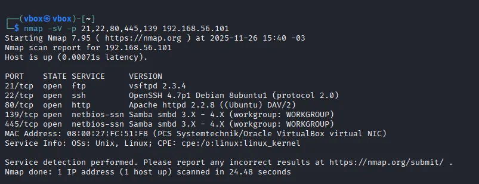

# 10.1 - Realizando desafio

## Desafio - ataque de força bruta com medusa (SMB)

Para realizar este desafio foram utilizadas duas máquinas virtuais: **Kali Linux** e **Metasploitable**.

O **Kali Linux** foi utilizado como máquina atacante, onde executamos o Medusa, e o **Metasploitable** atuou como alvo, contendo o serviço SMB habilitado e vulnerável.

> Obs.: Para o sucesso da atividade, é importante configurar corretamente a rede das VMs (modo bridge, NAT ou Host-only), garantindo que ambas estejam na mesma faixa de IP.
> 

### 1 - Varredura

Com as duas máquinas configuradas, iniciamos a primeira etapa, que consiste em realizar uma **varredura de rede** para identificar hosts ativos e verificar se o serviço SMB está disponível no alvo. O protocolo Samba/SMB costuma utilizar a porta **139 ou 445**, então nossa varredura será voltada para essa porta, pois é nela que realizaremos o ataque de força bruta.

```jsx
nmap -p 137,138,139,445 192.168.56.0/24

```

### Enumeração

Após a varredura inicial e a identificação de hosts ativos, iniciamos o processo de **enumeração**, que consiste em coletar informações adicionais sobre o sistema alvo. Nesta etapa buscamos conhecer melhor os serviços disponíveis, versões e possíveis pontos vulneráveis.

A varredura anterior revelou que o host **192.168.56.101** está acessível na rede. A partir disso, realizamos uma enumeração mais detalhada focada nas portas SMB, com o objetivo de entender melhor o ambiente antes de iniciar o ataque de força bruta.

```jsx
nmap -sV -p 21,22,80,445,139 192.168.56.101
```




### 3 - Wordlist

Com todas essas informações obtidas na enumeração, podemos criar nossas **wordlists** contendo usuários e senhas fracas, comuns ou baseadas em informações previamente coletadas durante o reconhecimento. Esse tipo de lista será usado posteriormente no ataque de força bruta com o Medusa.

Caso não tenhamos informações suficientes para montar uma wordlist manualmente, podemos utilizar ferramentas de enumeração SMB para tentar identificar potenciais usuários, compartilhamentos e outras informações do sistema alvo.

```jsx
enum4linux -a 192.168.56.101 | tee enum4_output.txt
```

Podemos ler esse arquivo com o comando less, e retirar algumas infos se tiver nele.

para criar a wordlist de usuários e senhas usamos o comando: 

```jsx
echo -e "user\msfadmin\nadmin\nroot" > smb_users.txt
```

```jsx
echo -e "123456\npassword\nqwerty\msfadmin" > senhas_spray.txt
```

### 4 - Ataque

Com todas essas informações reunidas durante a enumeração, já podemos iniciar o ataque de força bruta utilizando o **Medusa**, alimentando a ferramenta com os arquivos contendo os usuários e senhas descobertos ou gerados nas wordlists. O comando abaixo utiliza esses dois arquivos como tentativa de autenticação SMB no alvo:

```jsx
medusa -h 192.168.56.101 -U smb_users.txt -P senhas_spray.txt -M smbnt -t 2 -T 50
```

No log gerado pelo Medusa podemos observar todas as tentativas de autenticação. Se houver alguma linha marcada como **SUCCESS**, significa que aquela combinação de usuário e senha foi aceita pelo servidor SMB, indicando que essa é a credencial válida para acesso.

Após identificar o login correto, podemos testar manualmente o acesso ao serviço SMB utilizando as credenciais obtidas. Para isso, utilizamos o comando:
